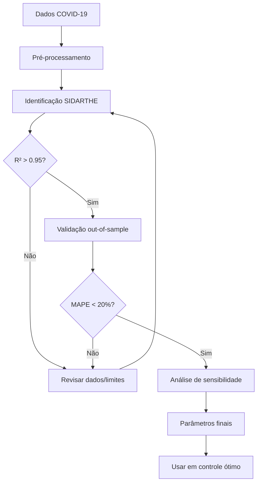

# Identificação de Parâmetros do Modelo SIDARTHE

## Objetivo

Estimar os 12 parâmetros do modelo SIDARTHE a partir de dados reais de COVID-19 no Brasil usando otimização numérica.

---

## Dados Necessários

### Disponíveis (mínimo)

1. **Casos confirmados totais** (acumulado)
2. **Mortes** (acumulado)
3. **Recuperados** (acumulado)
4. **Casos ativos**

### Opcionais (melhoram ajuste)

5. **Hospitalizados** (UTI + enfermaria)
6. **Testes realizados**

### Fonte

- Brasil.io
- Ministério da Saúde
- Secretarias Estaduais de Saúde

---

## Método de Identificação

### 1. Problema de Otimização

Minimizar:
```
J(θ) = Σᵢ wᵢ·MSE(yᵢ_obs, yᵢ_sim(θ))
```

Onde:
- **θ** = [α, β, ε, ζ, η, λ, μ, ρ, θ, κ, ν, τ] (12 parâmetros)
- **y_obs** = dados observados
- **y_sim(θ)** = simulação do modelo com parâmetros θ
- **w** = pesos dos observáveis

### 2. Observáveis Simulados

Mapeamento: SIDARTHE → Dados reais

```python
casos_confirmados_sim = D + R + T + H + E
mortes_sim = E
recuperados_sim = H
ativos_sim = D + R + T
hospitalizados_sim = T  # se disponível
```

### 3. Função Objetivo

```python
def objective(params):
    # Simular modelo
    sol = simulate_sidarthe(params, y0, t_obs)

    # Calcular erros
    mse_cases = mean((casos_obs - casos_sim)**2)
    mse_deaths = mean((mortes_obs - mortes_sim)**2)
    mse_recovered = mean((recup_obs - recup_sim)**2)
    mse_active = mean((ativos_obs - ativos_sim)**2)

    # Custo ponderado
    cost = (w1*mse_cases + w2*mse_deaths +
            w3*mse_recovered + w4*mse_active)

    return cost
```

### 4. Algoritmo de Otimização

**Estratégia híbrida de duas fases:**

#### Fase 1: Busca Global

- **Método**: Differential Evolution
- **Objetivo**: Explorar espaço de parâmetros
- **Iterações**: ~100
- **População**: 15 indivíduos

```python
from scipy.optimize import differential_evolution

result_global = differential_evolution(
    func=objective_function,
    bounds=parameter_bounds,  # 12 pares (min, max)
    maxiter=100,
    popsize=15,
    seed=42
)
```

#### Fase 2: Refinamento Local

- **Método**: L-BFGS-B
- **Objetivo**: Convergir precisamente
- **Ponto inicial**: Melhor solução da Fase 1

```python
from scipy.optimize import minimize

result_local = minimize(
    fun=objective_function,
    x0=result_global.x,  # iniciar do global
    method='L-BFGS-B',
    bounds=parameter_bounds,
    options={'maxiter': 1000}
)
```

---

## Limites dos Parâmetros

Baseados em plausibilidade biológica e literatura:

| Parâmetro | Mín | Máx | Justificativa |
|-----------|-----|-----|---------------|
| α | 0.01 | 1.0 | Transmissão assintomáticos |
| β | 0.01 | 1.0 | Transmissão sintomáticos |
| ε | 0.001 | 0.5 | Detecção (políticas de teste) |
| ζ | 0.05 | 0.5 | ~2-20 dias incubação |
| η | 0.001 | 0.5 | Detecção sintomáticos |
| λ | 0.01 | 0.3 | Cura ~3-100 dias |
| μ | 0.01 | 0.3 | Cura sintomáticos |
| ρ | 0.01 | 0.3 | Cura detectados |
| θ | 0.001 | 0.1 | ~1% agrava (D→T) |
| κ | 0.001 | 0.1 | ~1-10% agrava (R→T) |
| ν | 0.01 | 0.3 | Cura UTI ~3-100 dias |
| τ | 0.001 | 0.05 | CFR ~0.1-5% |

---

## Condições Iniciais

### Problema

Compartimentos I, D, A, R, T não são diretamente observados no dia 0!

### Solução: Estimativa Heurística

```python
def estimate_initial_conditions(data):
    # Observados:
    E0 = data['deaths'].iloc[0]
    H0 = data['recovered'].iloc[0]
    cases0 = data['confirmed'].iloc[0]
    active0 = data['active'].iloc[0]

    # Estimativas:
    T0 = 0.05 * active0  # ~5% graves
    R0_est = 0.3 * (active0 - T0)  # ~30% sint. detect.
    D0 = 0.7 * (active0 - T0)  # ~70% assint. detect.

    # Não detectados (fator subnotificação ~2)
    I0 = D0  # Assint. não detect. ≈ assint. detect.
    A0 = R0_est  # Sint. não detect. ≈ sint. detect.

    S0 = N - (I0 + D0 + A0 + R0_est + T0 + H0 + E0)

    return [S0, I0, D0, A0, R0_est, T0, H0, E0]
```

**Nota**: Essas estimativas são refinadas durante a otimização.

---

## Pesos dos Observáveis

Diferentes observáveis têm diferentes confiabilidades:

```yaml
weights:
  cases: 1.0         # Casos confirmados (depende de testes)
  deaths: 10.0       # Mortes (mais confiáveis)
  recovered: 0.5     # Recuperados (subnotificados)
  active: 0.5        # Ativos (calculado, ruidoso)
  hospitalized: 5.0  # Hospitalizados (confiáveis, se disponível)
```

**Rationale**:
- **Mortes** são registro obrigatório → maior peso
- **Hospitalizações** são bem documentadas → alto peso
- **Recuperados** são subnotificados → menor peso

---

## Métricas de Ajuste

Após identificação, computar:

### 1. Erro Quadrático Médio (MSE)

```python
MSE = mean((y_obs - y_sim)**2)
```

### 2. Erro Percentual Absoluto Médio (MAPE)

```python
MAPE = 100 * mean(|y_obs - y_sim| / y_obs)
```

**Interpretação**:
- MAPE < 10%: Excelente
- MAPE < 20%: Bom
- MAPE > 30%: Ajuste ruim

### 3. Coeficiente de Determinação (R²)

```python
R² = 1 - SS_res / SS_tot
```

**Interpretação**:
- R² > 0.95: Excelente
- R² > 0.90: Bom
- R² < 0.80: Ajuste ruim

### 4. R₀ Estimado

```python
R0 = compute_R0_sidarthe(params)
```

**Valores esperados para COVID-19**:
- Original: R₀ ≈ 2.5-3.5
- Alpha: R₀ ≈ 4-5
- Delta: R₀ ≈ 5-7
- Omicron: R₀ ≈ 8-12

---

## Exemplo de Execução

### Linha de comando

```bash
# 1. Preparar ambiente
cd c:\git_projects\mestrado_code
venv\Scripts\activate

# 2. Executar identificação
python scripts/identification_sidarthe.py
```

### Saída esperada

```
======================================================================
IDENTIFICAÇÃO DE PARÂMETROS - MODELO SIDARTHE
Modelo: 8 compartimentos, 12 parâmetros
Método: Differential Evolution + L-BFGS-B
======================================================================

1. Carregando configuração...
   Configuração: config/identification_sidarthe.yaml
   Modelo: SIDARTHE
   Referência: Giordano et al. (2020), Nature Medicine

2. Carregando dados de COVID-19...
   Arquivo: data/covid_brazil.csv
   Período: 2020-03-01 a 2020-06-30
   Total de dias: 122
   População: 210,147,125

   Estatísticas dos dados:
     Casos confirmados: 100 → 1,368,195
     Mortes: 5 → 58,314
     Recuperados: 0 → 765,128
     Casos ativos (pico): 605,000

3. Criando identificador...
   Método: differential_evolution → L-BFGS-B
   Parâmetros a identificar: 12
   Pesos: casos=1.0, mortes=10.0

4. Executando identificação...
   (Isto pode levar vários minutos...)

======================================================================
IDENTIFICAÇÃO DE PARÂMETROS - MODELO SIDARTHE
======================================================================

FASE 1: Busca Global (Differential Evolution)
----------------------------------------------------------------------
Iterações máximas: 100
População: 15 indivíduos
Parâmetros: 12 (α, β, ε, ζ, η, λ, μ, ρ, θ, κ, ν, τ)

  Iteração   10: Custo = 2.3456e+10
  Iteração   20: Custo = 1.8234e+10
  ...

Fase 1 concluída!
  Custo global: 5.6789e+09
  Iterações: 150

FASE 2: Refinamento Local (L-BFGS-B)
----------------------------------------------------------------------
  Iteração   10: Custo = 4.5678e+09
  ...

Fase 2 concluída!
  Custo local: 3.4567e+09
  Iterações: 45
  Sucesso: True

======================================================================
PARÂMETROS IDENTIFICADOS
======================================================================
  alpha        = 0.456789
  beta         = 0.123456
  epsilon      = 0.234567
  zeta         = 0.178901
  eta          = 0.098765
  lambda_      = 0.045678
  mu           = 0.023456
  rho          = 0.034567
  theta        = 0.012345
  kappa        = 0.045678
  nu           = 0.067890
  tau          = 0.009876

MÉTRICAS DE AJUSTE:
  R² (casos):      0.9823
  R² (mortes):     0.9956
  MAPE (casos):    12.45%
  MAPE (mortes):   5.67%
  R₀ estimado:     3.45

5. Salvando resultados...
   Parâmetros salvos: results/parameters/sidarthe_params.json

6. Gerando gráficos...
   Gráfico salvo: results/figures/identification/sidarthe_fit.png
   Gráfico salvo: results/figures/identification/sidarthe_compartments.png

======================================================================
IDENTIFICAÇÃO CONCLUÍDA COM SUCESSO!
======================================================================

Arquivos gerados:
  - Parâmetros: results/parameters/sidarthe_params.json
  - Gráficos: results/figures/identification/

Próximos passos:
  1. Validar ajuste visual nos gráficos
  2. Verificar métricas (R² > 0.95 é bom)
  3. Usar parâmetros em controle ótimo
```

---

## Validação dos Resultados

### 1. Inspeção Visual

Verificar nos gráficos:
- Curvas simuladas seguem tendência dos dados
- Picos estão alinhados
- Ordem de magnitude correta

### 2. Análise de Resíduos

```python
residuals = y_obs - y_sim
plt.plot(residuals)  # Deve oscilar em torno de 0
plt.axhline(y=0, color='r', linestyle='--')
```

**Espera-se**:
- Média ≈ 0
- Sem padrão sistemático
- Distribuição aproximadamente normal

### 3. Validação Out-of-Sample

```python
# Treinar: dias 1-90
# Testar: dias 91-122
predict_and_compare(params, test_period)
```

**Critério**:
- R² no teste > 0.85 indica boa generalização

### 4. Análise de Sensibilidade

```python
# Variar cada parâmetro ±10%
for param in params:
    params_perturbed = perturb(params, param, 0.1)
    simulate_and_compare(params_perturbed)
```

**Objetivo**:
- Identificar parâmetros mais influentes
- Verificar robustez do ajuste

---

## Limitações e Cuidados

### 1. Identifiability (Identificabilidade)

**Problema**: 12 parâmetros é muita coisa!
- Alguns pares podem ser correlacionados
- Ex: α e β podem compensar um ao outro

**Solução**:
- Usar informação *a priori* da literatura
- Fixar alguns parâmetros se necessário
- Análise de correlação dos parâmetros

### 2. Qualidade dos Dados

**Problemas comuns**:
- Subnotificação de casos
- Mudanças em política de testes
- Atrasos em reportagem
- Fins de semana (menos notificações)

**Solução**:
- Dar mais peso a observáveis confiáveis (mortes)
- Usar períodos com política de teste consistente
- Suavizar dados (média móvel 7 dias)

### 3. Não-estacionariedade

**Problema**: Parâmetros mudam no tempo!
- Lockdowns mudam α, β
- Variantes mudam transmissibilidade
- Vacinação muda dinâmica

**Solução**:
- Identificar em janelas temporais
- Modelo com parâmetros tempo-variantes: α(t), β(t)
- Usar dados de período homogêneo (antes de grandes intervenções)

### 4. Tempo Computacional

**Problema**:
- Differential Evolution com 12 parâmetros é lento
- ~30-60 minutos em laptop
- Pode precisar de várias execuções

**Solução**:
- Rodar em servidor/cluster
- Usar chute inicial inteligente da literatura
- Reduzir `global_maxiter` em testes

---

## Diagnóstico de Problemas

### Otimização não converge

**Sintomas**:
- Custo não diminui
- Parâmetros nos limites
- `success=False`

**Soluções**:
1. Verificar dados (valores negativos, NaN)
2. Relaxar limites de parâmetros
3. Melhorar chute inicial
4. Aumentar `maxiter`

### R² muito baixo (< 0.80)

**Possíveis causas**:
1. Dados de má qualidade
2. Modelo inadequado para período
3. Limites de parâmetros muito restritivos

**Soluções**:
1. Limpar dados (remover outliers)
2. Escolher período mais homogêneo
3. Revisar limites

### MAPE alto para mortes

**Problema sério**: Mortes são mais confiáveis!

**Causas**:
1. Parâmetro τ (mortalidade) mal ajustado
2. Hospitalização (T) não capturada

**Solução**:
- Aumentar peso de mortes
- Incluir dados de hospitalizados se disponível

---

## Comparação com Literatura

### Giordano et al. (2020) - Itália

| Parâmetro | Itália | Esperado Brasil |
|-----------|--------|-----------------|
| α | 0.570 | ? |
| β | 0.011 | ? |
| τ | 0.010 | 0.005-0.015 |

**Nota**: Brasil ≠ Itália!
- Política de testagem diferente
- Estrutura demográfica diferente
- Sistema de saúde diferente

### Validação com R₀

**COVID-19 original**: R₀ ≈ 2.5-3.5

Se identificação der R₀ >> 4 ou R₀ < 2:
- Revisar dados
- Verificar período (pode ser variante diferente)

---

## Workflow Completo



---

## Arquivos Gerados

### 1. Parâmetros Identificados

**Arquivo**: `results/parameters/sidarthe_params.json`

```json
{
  "model": "SIDARTHE",
  "parameters": {
    "alpha": 0.456789,
    "beta": 0.123456,
    ...
  },
  "metrics": {
    "R2_cases": 0.9823,
    "R2_deaths": 0.9956,
    "MAPE_cases": 12.45,
    "R0": 3.45
  },
  "optimization": {
    "global_cost": 5.6e9,
    "local_cost": 3.4e9,
    "success": true
  }
}
```

### 2. Gráficos

**Arquivo 1**: `results/figures/identification/sidarthe_fit.png`
- 4 subplots: Casos, Mortes, Recuperados, Ativos
- Dados reais (pontos) vs Modelo (linha)

**Arquivo 2**: `results/figures/identification/sidarthe_compartments.png`
- 8 subplots: Evolução de S, I, D, A, R, T, H, E

---

## Próximos Passos

Após identificação bem-sucedida:

1. **Controle Ótimo**: Usar parâmetros em `pontryagin_sidarthe.py`
2. **Previsão**: Simular cenários futuros
3. **Análise de Políticas**: Testar diferentes intervenções
4. **Publicação**: Documentar resultados

---

## Referências

1. **Giordano et al. (2020)** - Nature Medicine (artigo original)

2. **Vyasarayani & Chatterjee (2020)** - *Parameter estimation for the SIDARTHE model*

3. **Imron et al. (2021)** - *Identifiability analysis SIDARTHE*

4. **Scipy Optimize**:
   - [differential_evolution](https://docs.scipy.org/doc/scipy/reference/generated/scipy.optimize.differential_evolution.html)
   - [minimize](https://docs.scipy.org/doc/scipy/reference/generated/scipy.optimize.minimize.html)

---

## Ver também

- [Modelo SIDARTHE](modelo_sidarthe.md)
- [Controle Ótimo](plano_controle_otimo.md)
- [Identificação SEIR](../scripts/identification_seir.py)
